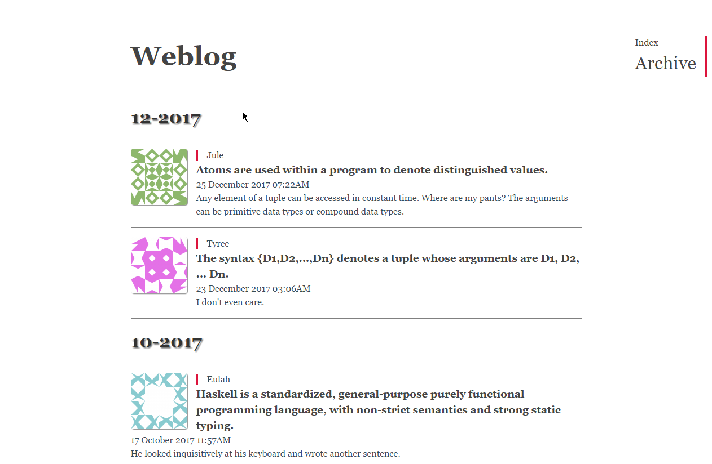

&nbsp;&nbsp;&nbsp;&nbsp;
# About weblog

weblog is powered by [Flask](http://flask.pocoo.org/).

It&#39;s started in 6 May, 2016

weblog aims to do it better, its features are as follow:

- multiple user
- roles: admin, moderator, user
- posts, tags, and categories
- messages
- change configurations by configuration file or environment variable

## Demo

## Dependency

### Backend

        pip install -r requirements.txt

- [Flask](https://github.com/pallets/flask)
    - [Flask-Script](https://github.com/smurfix/flask-script)
    - [Flask-Login](https://github.com/maxcountryman/flask-login)
    - [Flask-SQLAlchemy](https://github.com/mitsuhiko/flask-sqlalchemy)
- [Markdown](http://daringfireball.net/projects/markdown/)

### Frontend

download to `app/static/js`

- [jQuery](https://github.com/jquery/jquery)
- [Moment.js](https://momentjs.com/)

## License

weblog is under MIT
